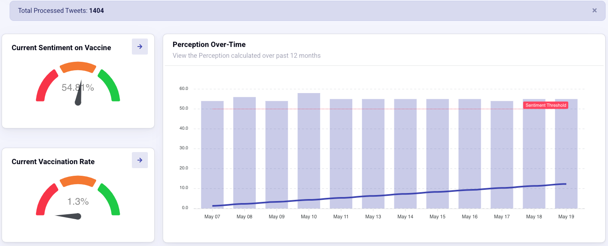

# Sentiment_Analysis_System

## 1. Software Architecture

### Dashboard

### Click through

### Sentiment Distribution Illustration

## Contributors

- Chaoyin: Flask(framework/MVC), Analytics Engine 
- Harry: Frontend(client Side), Tweet Havester
- Chinmayee: Analytics Engine, Counch DB
- yisur: Counch DB
- jiaqi: Tweet Parser, Deployment
